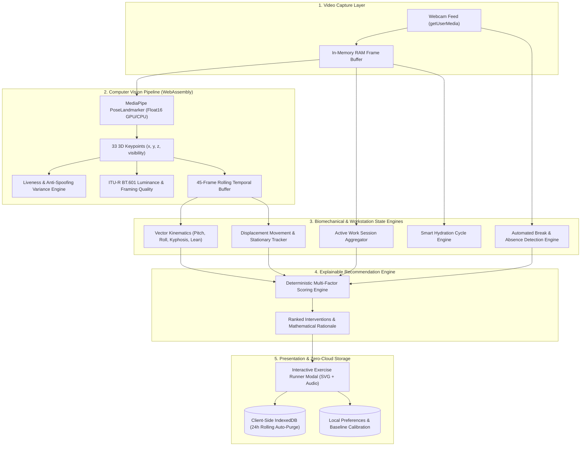

# 🧘‍♂️ SitSense — AI-Powered Workplace Wellness & Posture Intelligence

<div align="center">

[](https://react.dev/)
[](https://www.typescriptlang.org/)
[](https://vitejs.dev/)
[](https://developers.google.com/mediapipe)
[](https://webassembly.org/)
[](#-zero-telemetry-local-first-architecture)
[](LICENSE)

<p align="center">
  <strong>A production-grade, privacy-preserving computer vision system for real-time ergonomics, cervical/thoracic posture tracking, sedentary break classification, and targeted biomechanical micro-interventions.</strong>
</p>

</div>

---

## 📖 Executive Overview

**SitSense** is a 100% client-side, real-time workplace wellness application engineered to combat the physical toll of sedentary desk work. Using **Google MediaPipe PoseLandmarker (Float16 quantized WebAssembly / WebGL)**, SitSense processes live camera feeds strictly within browser RAM at 20+ FPS to extract 33 anatomical 3D landmarks. 

It calculates scale-invariant postural kinematics, smooths rapid movements through a **45-frame temporal rolling buffer**, checks camera illumination and optical liveness, and feeds real-time telemetry into an **explainable deterministic recommendation engine** that prescribes targeted biomechanical resets without ever streaming a single pixel to the cloud.

---

## 🌟 Key Engineering Features

- 🔒 **100% Local-First & Airgapped by Design**: Video frames from `getUserMedia()` reside exclusively in volatile GPU/CPU RAM for inference (~16ms) and are immediately discarded. **Zero frames, images, or webcam data are ever stored or transmitted to external servers.**
- 🤖 **MediaPipe 33-Landmark Pose Estimation**: Real-time 3D anatomical keypoint extraction with automatic WebGL GPU delegate execution and graceful CPU WebAssembly fallback.
- 📐 **Vector-Based Biomechanical Kinematics**:
  - **Forward Head Pitch**: Ear-to-shoulder cranial vector angle relative to the gravity axis.
  - **Shoulder Slope Asymmetry**: Left-to-right shoulder inclination angle.
  - **Lateral Head Tilt (Roll)**: Contralateral ear angle delta.
  - **Thoracic Kyphosis & Slouch Compression**: Cranial-to-shoulder distance normalized by real-time shoulder span (scale and distance invariant).
  - **Torso Lateral Lean**: Hip-to-shoulder spinal axial inclination.
- ⏳ **45-Frame Temporal Hysteresis & Debounce Buffer**: Calculates moving averages and spatial variances across ~2.5 seconds to eliminate noise from natural fidgeting and typing while accurately catching sustained poor posture (> 20s).
- 👁️ **Optical Liveness & Anti-Spoofing Checker**: Real-time spatial variance tracking over facial landmarks to identify and flag static photo spoofing ($\sigma^2 < 0.00008$).
- 💡 **ITU-R BT.601 Luminance & Framing Diagnostics**: Real-time canvas pixel luminance evaluation ($32 \times 32$ subsampling) with low-light, overexposure, and edge-cutoff warnings.
- 🚶 **Sedentary Duration & Automated Break Classifier**: Automatically measures continuous sitting intervals and categorizes user absences into **Micro Breaks** (30s–2m), **Short Breaks** (2m–10m), and **Extended Breaks** (>10m).
- 💧 **Smart Hydration Engine & Procedural Audio Chimes**: Automated reminder cycles with Web Audio API procedural synthesis (water droplets, timer ticks, completion chords) with zero external audio assets.
- 🧠 **Explainable Deterministic Recommendation Matrix**: Scores 18+ physical routines based on live postural deltas, sedentary sitting duration, screen exposure time, fatigue cooldowns, and repetition penalties. Every recommendation provides transparent mathematical reasoning.
- 🎨 **18+ Dynamic SVG Mechanical Visualizers**: Interactive routines featuring animated anatomical movement paths, muscle engagement highlights, step checklists, countdown timers, and confetti completion.
- 🎯 **Baseline Posture Calibration Wizard**: 3-second neutral reference capture tailored to individual desk setups and camera mount heights.
- 🧪 **Interactive Evaluator Demo Controller**: Scenario injector simulating slouch alerts, eye fatigue, healthy flows, and user absence for instant presentation and stress testing.

---

## 🏗️ System Architecture & Data Pipeline



---

## 📐 Mathematical Formulations

### 1. Scale-Invariant Thoracic Slouch & Kyphosis Compression
To eliminate distance ambiguity from monocular 2D webcams, vertical cranial displacement is normalized against the instantaneous Euclidean shoulder span:

$$\text{ShoulderWidth} = \sqrt{(X_{\text{Right}} - X_{\text{Left}})^2 + (Y_{\text{Right}} - Y_{\text{Left}})^2}$$

$$\text{NoseToShoulderDist} = \frac{Y_{\text{ShoulderMid}} - Y_{\text{Nose}}}{\text{ShoulderWidth}}$$

$$\text{SlouchScore} = \min\left(1.0, \max\left(0, \frac{\text{BaselineDist} - \text{NoseToShoulderDist}}{\text{BaselineDist}} \times 1.6\right)\right)$$

### 2. Cranial Forward Head Pitch
Calculated as the angle deviation of the ear midpoint relative to the shoulder midpoint against the vertical gravity axis:

$$\theta_{\text{ForwardHead}} = \left| \text{atan2}(X_{\text{EarMid}} - X_{\text{ShoulderMid}},\, Y_{\text{ShoulderMid}} - Y_{\text{EarMid}}) \right| \times \frac{180^\circ}{\pi}$$

### 3. Shoulder Slope Asymmetry (Lateral Tilt)
$$\theta_{\text{ShoulderSlope}} = \min\left(\theta_{\text{raw}},\, |180^\circ - \theta_{\text{raw}}|\right) \quad \text{where} \quad \theta_{\text{raw}} = \left| \text{atan2}(\Delta Y_{\text{Shoulder}},\, \Delta X_{\text{Shoulder}}) \right| \times \frac{180^\circ}{\pi}$$

### 4. Facial Micro-Jitter Spatial Variance (Liveness Verification)
$$\sigma^2 = \frac{1}{N} \sum_{i=1}^{N} \left( (X_{\text{Nose}, i} - \bar{X}_{\text{Nose}})^2 + (Y_{\text{Nose}, i} - \bar{Y}_{\text{Nose}})^2 \right)$$

$$\text{Status} = \begin{cases} \text{STATIC-WARNING} & \text{if } \sigma^2 < 0.00008 \text{ for } N \ge 35 \\ \text{LIVE-HIGH} & \text{otherwise} \end{cases}$$

### 5. ITU-R BT.601 Camera Luminance Check
$$Y = \frac{1}{1024} \sum_{i=1}^{1024} \left( 0.299 R_i + 0.587 G_i + 0.114 B_i \right)$$

---

## 📚 Evidence-Based Exercise Library Catalog

SitSense includes 18+ physical and visual routines designed for workstation ergonomics:

| Category | Routines Included | Target Anatomy & Ergonomic Impact |
| :--- | :--- | :--- |
| **Neck & Cervical** | Chin Tucks, Neck Rotation Flow, Lateral Neck Stretch | Deep cervical flexors, sternocleidomastoid, upper trapezius decompression. |
| **Shoulders & Scapula** | Shoulder Rolls, Cross-Body Stretch, Scapular Retraction | Deltoids, rotator cuff, rhomboids activation against desk hunching. |
| **Upper Back & Thoracic** | Thoracic Extension, Seated Upper-Back Clasp, Seated Spinal Twist | Counteracts thoracic kyphosis and facet joint spinal stiffness. |
| **Wrists & Forearms** | Wrist Flexor Stretch, Wrist Extensor Stretch, Wrist Waves | Prevents Repetitive Strain Injury (RSI) and decompresses carpal tunnel. |
| **Legs & Circulation** | Seated Leg Extension, Calf Raises (Venous Pump), Ankle Circles | Stimulates venous return and prevents lower-extremity pooling. |
| **Full-Body Mobility** | Seated March, Full-Body Overhead Reach, 90s Ergonomic Reset | Systemic multi-joint reactivation, core engagement, and posture reset. |
| **Visual / Eye Breaks** | 20-20-20 Distance Focus, Blink Rate Reset, Eye Palming | Relaxes ciliary eye muscles, rehydrates cornea, and rests photoreceptors. |

---

## 🔐 Zero-Telemetry Local-First Architecture

SitSense operates under strict zero-telemetry principles:

1. **In-RAM Frame Lifecycle**: Camera frames are processed directly via WebAssembly in GPU memory and immediately garbage-collected. No canvas is converted to Blob, JPEG, or Base64.
2. **Zero Network Traffic**: No third-party tracking, no telemetry beacons, no cloud databases, and no external LLM APIs.
3. **24-Hour Rolling IndexedDB Auto-Purge**: All session analytics and break records are timestamped and permanently wiped after 24 hours.
4. **1-Click Factory Reset**: The Privacy Center provides instant controls to reset active sessions, wipe IndexedDB history, and restore factory defaults.

---

## 🛠️ Technology Stack

| Domain | Technology | Purpose |
| :--- | :--- | :--- |
| **Frontend Core** | React 19, TypeScript 5.7 | High-performance reactive UI with strict type safety. |
| **Tooling & Bundler** | Vite 6, PostCSS, TailwindCSS | Sub-second HMR and production bundle optimization. |
| **Computer Vision** | Google MediaPipe Vision Tasks (`@mediapipe/tasks-vision`) | Client-side 33-point 3D landmark detection (WASM/GPU). |
| **Audio Engine** | Web Audio API | Procedural audio synthesis with zero audio file downloads. |
| **Local Storage** | IndexedDB, LocalStorage | Local session metrics with automated 24h rolling TTL. |
| **Icons & Visuals** | Lucide React, Canvas Confetti | Modern UI iconography and celebration effects. |

---

## 🚀 Quick Start & Local Setup

### Prerequisites
- **Node.js**: v18.0 or higher
- **npm**: v9.0 or higher
- Modern browser with WebGL and WebAssembly support (Chrome, Edge, Firefox, Brave, Safari)

### Installation

```bash
# 1. Clone the repository
git clone https://github.com/Tensai-Kartik/SitSense.git

# 2. Navigate to project root
cd SitSense

# 3. Install dependencies
npm install

# 4. Launch local development server
npm run dev
```

Open **`http://localhost:5173/`** in your browser.

### Production Build & Preview

```bash
# Type check and generate production bundle
npm run build

# Preview production build locally
npm run preview
```

---

## 🧪 Evaluator & Demo Presentation Guide

For quick live demonstrations and presentations:

1. Click **Demo Mode** in the header or bottom right floating toolbar.
2. Use instant scenario presets:
   - **Slouch Alert**: Simulates 38m sedentary sitting with forward head and kyphosis to trigger immediate recommendation scoring.
   - **Eye Fatigue**: Simulates 55m continuous display exposure, triggering the 20-20-20 visual reset.
   - **Healthy Flow**: Resets posture to neutral with active movement scoring.
   - **User Away**: Simulates stepping away from the desk to test the automatic Break Detection Engine.
3. Open the **Developer Diagnostics Panel** at the bottom of the page to inspect real-time vector angles, temporal rolling variances, camera FPS, and candidate scoring matrices.

---

## ⚖️ Engineering & Medical Disclaimer

*SitSense is an engineering demonstration tool providing general workplace wellness suggestions based on computer-vision physical activity and posture metrics. It is not a medical device and does not provide clinical diagnoses, orthopedic treatment, or medical advice.*

---

## 📄 License

Distributed under the **MIT License**. See `LICENSE` for more information.

<div align="center">
  <sub>Built with ❤️ for healthier, pain-free workstation ergonomics.</sub>
</div>
